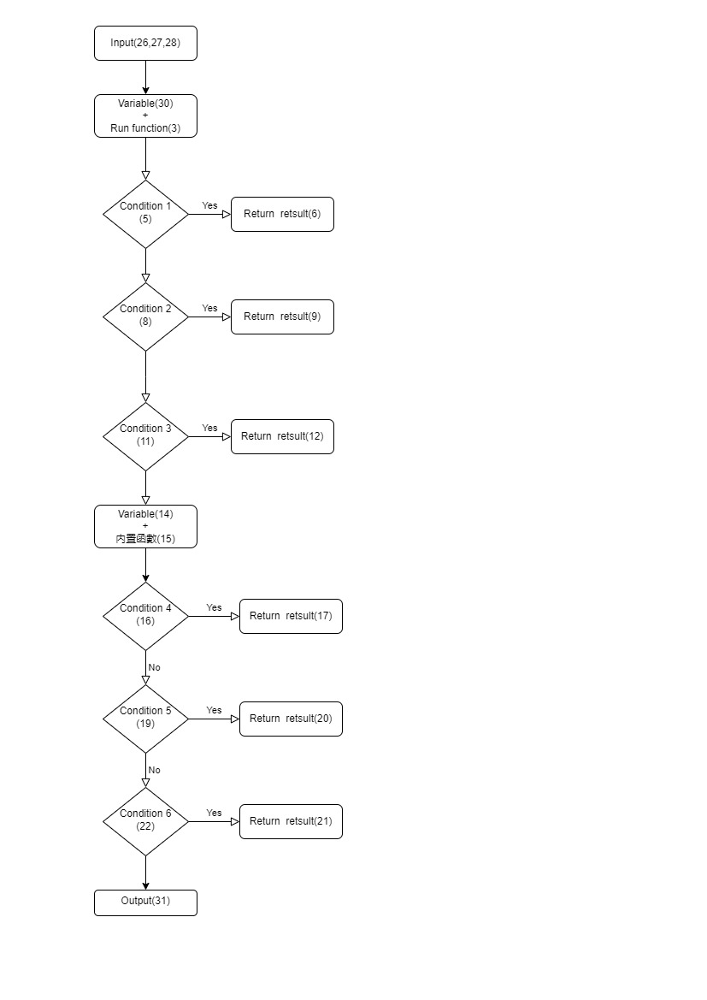

# 題目：
**005. 判斷何種三角形**  
當三個邊長能構成三角形時，判斷該三角形是否為正三角形，若否，則判斷是否為等腰三角形。若皆非正三角形或等腰三角形，再判斷該三角形為鈍角三角形、銳角三角形或直角三角形。  

**1. 不能成為三角形**：任兩邊和不大於第三邊，或任一邊長不大於0  
**2. 正三角形**：三個邊相等  
**3. 等腰三角形**：任兩邊相等，且平方和大於第三邊的平方  
**4. 鈍角三角形**: 最長邊平方大於兩短邊平方和  
**5. 銳角三角形**: 最長邊平方小於兩短邊平方和  
**6. 直角三角形**: 最長邊平方等於兩短邊平方和  

此題必須寫一個運算的function  
***def getTriangle(a, b, c)***

## 輸入參數資料型態與類別說明:**  
1.輸入三個整數邊長(int)  

## 輸出參數資料型態與類別說明:**  
1. 不能成為三角形：輸出not a triangle  
2. 正三角形：輸出equilateral triangle  
3. 等腰三角形：輸出isosceles triangle  
4. 鈍角三角形:輸出obtuse triangle  
5. 銳角三角形:輸出acute triangle  
6. 直角三角形:輸出right triangle  

## 範例:
**輸入與輸出對應說明:**
**輸入**:第一行為第一邊邊長，第二行為第二邊邊長，第三行為第三邊邊長  
**輸出**:第一行為三角形種類  
**Input：**  
```
5  
2  
6
```
**Output：**  
>obtuse triangle  

----------------
# 測試案例(Test Case)資料：  
**Input：**  
```
4  
1  
1
```
**Output：**  
>not a triangle  

---------------
**Input：**  
```
3  
3  
3
```
**Output：**  
>equilateral triangle  

---------------
**Input：**    
```
3  
2  
3    
```  
**Output：**  
>isosceles triangle  

---------------
**Input：**  
```
8  
11  
5
```
**Output：**  
>obtuse triangle  

---------------
**Input：**  
```
5  
7  
8
```
**Output：**  
>acute triangle  

---------------
**Input：**  
```
3  
4  
5
```
**Output：**  
>right triangle  

-------
## 思路：


-------
# 代碼：
```python
#type of triangle
#20230919
def getTriangle(a,b,c):

    if a+b <= c or a+c <= b or b+c <= a or a <= 0 or b <= 0 or c <= 0:
        return "not a triangle"
    
    if a==b and b==c: #OR a==b==c
        return"equilateral triangle"
    
    if a==b and (a**2 +b**2) > c**2 or b==c and (b**2 +c**2) > a**2 or a==c  and (a**2 +c**2) > b**2:
            return "isosceles triangle"
            
    x = [a,b,c]
    x.sort()
    if int(x[2])**2 == int(x[0])**2 + int(x[1])**2:
        return "right triangle"

    elif int(x[2])**2 < int(x[0])**2 + int(x[1])**2:
            return "acute triangle"

    elif int(x[2])**2 > int(x[0])**2 + int(x[1])**2:
            return "obtuse triangle"


a = int(input())
b = int(input())
c = int (input())

result = getTriangle(a, b, c)
print(result)
```
