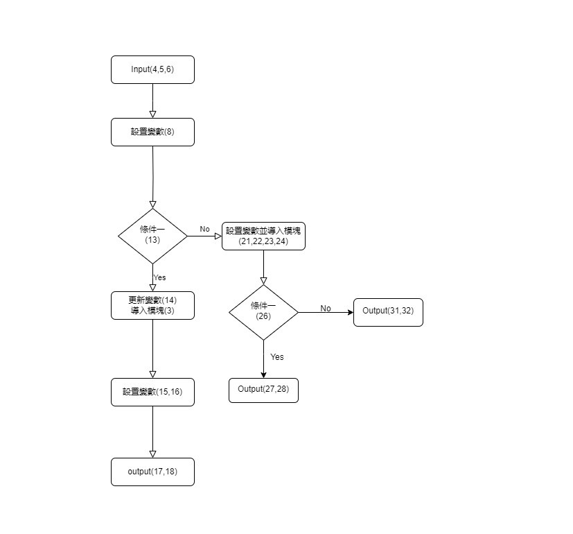

# 題目
**006. 一元二次方程式**  
**一元二次方程式:** *aX^2 + bx + c = 0*  
輸入a, b, c, 求方程式的兩個實/虛根  
***T = math.sqrt(b*b-4*a*c)***  
第一個根，x1 = (-b+T)/(2*a)  
第二個根，x2= (-b-T)/(2*a)  

**提示**：本題需 ***import math***  

---------------------------------------------------
**輸入說明：**  
**第一行**：輸入a (Integer)  
**第二行**：輸入b (Integer)   
**第三行**：輸入c (Integer)  

**輸出說明：**  
當T>=0，輸出x1, x2為實根，輸出到小數點第一位  
**第一行**：輸出 print("%.1f" %(x1))  
**第二行**：輸出 print("%.1f" %(x2))  

當T<0，輸出x1 , x2為虛根，輸出到小數點第一位  
**第一行**：輸出 print("%.1f+%.1fi" %(x11,x12))  
**第二行**：輸出 print("%.1f-%.1fi" %(x21,x22))  
若x11或x21為0.0時，則不須輸出正負號  

---------------------------------------------------
**Example Input 1**  
1  
-2  
1  
**Example Output 1**  
1.0  
1.0  

---------------------------------------------------
**Example Input 2**  
1  
2  
2  
**Example Output 2**  
-1.0+1.0i  
-1.0-1.0i  

---------------------------------------------------
**Example Input 3**  
2  
0  
2  
**Example Output 3**  
0.0+1.0i  
0.0-1.0i  

---
## 思路：

---
## 代碼
```python
#一元二次方程式
#20230919
import math
a = int(input())
b = int(input())
c = int (input())

T = (b**2-4*a*c)   
#(b^2 - 4ac)的值為負時，根號下會得到虛數
#在Python中，math.sqrt函數無法處理虛數，
#因此確實需要使用複數(complex)數據類型來處理這種情況

if T >=0:
    T = math.sqrt(T)
    x1 = (-b+T) / (2*a)
    x2 = (-b-T) / (2*a)
    print("%.1f" %(x1))
    print("%.1f" %(x2))
    
else: 
    x11 = -b / (2*a)
    x12 = math.sqrt(-T) / (2*a)
    x21 = -b / (2*a)
    x22 = math.sqrt(-T) / (2*a)
    
    if x11 == 0.0:
        print("%.1f+%.1fi" %(x11,x12))
        print("%.1f-%.1fi" %(x21,x22))
        
    else:
        print("%.1f+%.1fi" %(x11,x12))
        print("%.1f-%.1fi" %(x21,x22))
```
